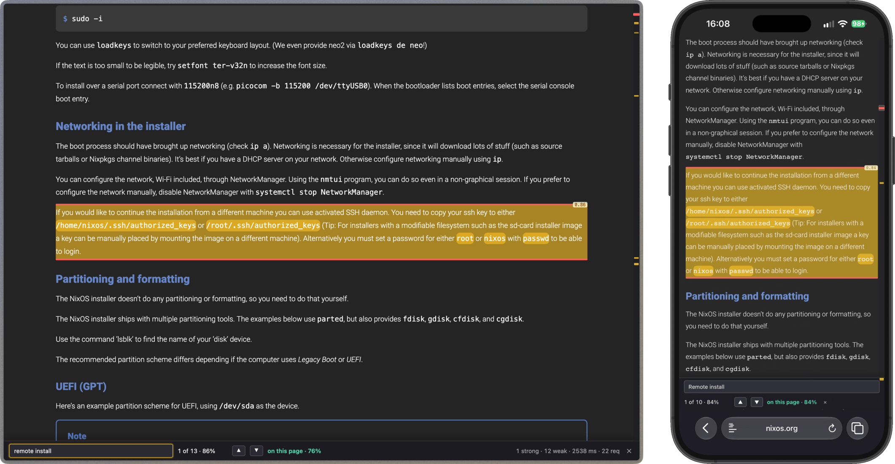

#  Hunch

<p align="center">
  
</p>

Ctrl+F with a hunch.
Ask a page a question and the paragraph that answers it lights up, with a probability next to it.
It also tells you when the answer is not on the page at all.

Powered by [TypeSafe AI](https://docs.typesafe.ai).
Jev is not an LLM. It does not generate text. When you use this extension you send a question to the API along the lines of:
Does *this* element on the page describes X.
Jev then goes through every element on that page and answers that questions with yes/no and a probability.
The extension then highlights the elements with the highest probability of being the answer.

## Use

- `Alt+F` on macOS, `Ctrl+Shift+F` elsewhere; Cmd+F and Ctrl+F stay the normal find. Change it in Hunch's settings page: click the shortcut field and press the keys you want. In Chrome, change it at chrome://extensions/shortcuts, where it is listed as "Activate the extension".
- Type in a search query. This can be a word you're looking for, a question, a sentence. Enter/Shift-Enter cycles you to the best first one and you can see all results on the scrollbar just like with normal search.

You need a TypeSafe API key. Open the extension settings, paste the key, pick a model, and save. Create a key at https://console.typesafe.ai/keys.

Optionally set **API base URL** if you want a TypeSafe-compatible gateway instead of the official host. Leave it blank to use `https://api.typesafe.ai`. When you save a custom URL, the browser will ask permission for that host.

https://github.com/user-attachments/assets/606156ad-5529-4db0-b348-4942c0b6c24b

## Where it cannot run

Browsers do not let extensions touch their built-in PDF viewer, `about:` and `chrome://` pages, reader view, or their extension stores. On those the toolbar icon briefly shows an `n/a` badge and nothing else happens.

## Develop

```sh
nix develop
npm install
npm run build
npm run watch
npm run check
npm run lint:fix
```

The build produces `dist/firefox`, `dist/chrome`, and `dist/safari`.

In Firefox, load `dist/firefox/manifest.json` as a temporary add-on at `about:debugging#/runtime/this-firefox`.
In Chrome, turn on Developer mode at `chrome://extensions` and click on `Load unpacked` on the `dist/chrome` folder.

All questions and thresholds live in `src/shared/questions.ts`. If you have any modification to how the search works, that's the best place to do them.

## How big pages are handled

One annoying thing about Jev today is the very small context window: 64k tokens.
That means both the state and the questions. Now I'm sure that's going to grow substantially in the future, but for right now my way around the issue when it comes to massive pages (say for example the curl man page), is to chunk the request into 160 blocks each, and send them all in parallel.
Results get drawn as soon as they come back. Normal pages will fit into one request most of the time.

## Privacy and licence

Page text is sent to your configured API host (TypeSafe by default) only while the bar is open on that page, and nothing else is collected. Details in [PRIVACY.md](PRIVACY.md). MIT licensed, see [LICENSE](LICENSE).
